# Document de Conception Global - Projet ASHS (Exhaustif)

Ce document présente une vue d'ensemble exhaustive et détaillée de l'architecture, de la conception et des flux du système ASHS (Association Sportive Hoenheim Sports).

---

## 1. Architecture Globale (Vue Simplifiée)

Le projet suit une architecture **Client-Serveur** moderne avec une séparation nette entre la présentation et la logique métier.

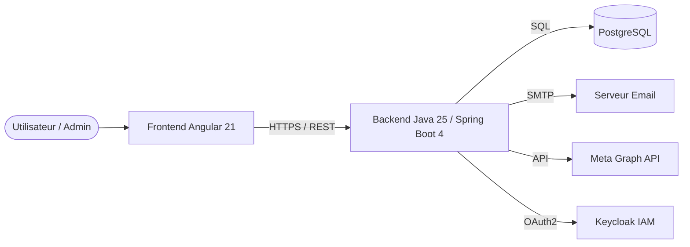
```mermaid
graph LR
    User([Utilisateur / Admin]) --> Frontend[Frontend Angular 21]
    Frontend -->|HTTPS / REST| Backend[Backend Java 25 / Spring Boot 4]
    Backend -->|SQL| DB[(PostgreSQL)]
    Backend -->|SMTP| Mail[Serveur Email]
    Backend -->|API| FB[Meta Graph API]
    Backend -->|OAuth2| Keycloak[Keycloak IAM]
```

---

## 2. Architecture Détaillée du Backend (Spring Modulith)

Le backend est conçu comme un **Monolithe Modulaire**. Chaque module représente un domaine métier autonome avec son propre schéma de base de données.

### Structure des Modules et Dépendances

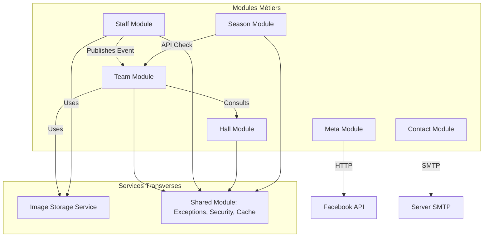
```mermaid
graph TD
    subgraph Modules Métiers
        Team[Team Module]
        Staff[Staff Module]
        Hall[Hall Module]
        Season[Season Module]
        Contact[Contact Module]
        Meta[Meta Module]
    end

    subgraph Services Transverses
        Image[Image Storage Service]
        Shared[Shared Module: Exceptions, Security, Cache]
    end

    Team -->|Uses| Image
    Team -->|Consults| Hall
    Staff -->|Uses| Image
    Staff -.->|Publishes Event| Team
    Season -->|API Check| Team
    Meta -->|HTTP| MetaAPI[Facebook API]
    Contact -->|SMTP| MailServer[Server SMTP]
    
    Team & Staff & Hall & Season --> Shared
```

*   **Encapsulation :** L'isolation est garantie par Spring Modulith. Seuls les DTOs et Services exposés dans les packages racines de chaque module sont accessibles.
*   **Communication Inter-Module :**
    *   **Directe :** Appels de services pour les lectures simples.
    *   **Événementielle :** Utilisation de `ApplicationEventPublisher` pour les actions à effets de bord (ex: suppression de staff).
*   **Sécurité :** Resource Server JWT validant les jetons émis par Keycloak.

---

## 3. Architecture Détaillée du Frontend (Angular Monorepo)

Le frontend utilise une structure de **Monorepo** (Nx-like) pour favoriser la réutilisation du code.

### Structure du Monorepo
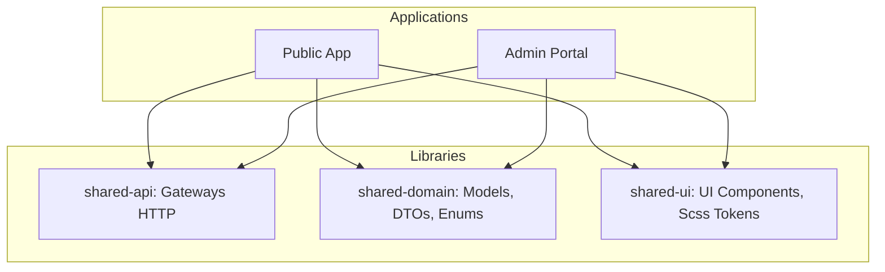
```mermaid
graph TD
    subgraph Applications
        App[Public App]
        Admin[Admin Portal]
    end

    subgraph Libraries
        SAPI[shared-api: Gateways HTTP]
        SDOM[shared-domain: Models, DTOs, Enums]
        SUI[shared-ui: UI Components, Scss Tokens]
    end

    App --> SAPI & SDOM & SUI
    Admin --> SAPI & SDOM & SUI
```

---

## 4. Architecture par Module (Détails Backend Exhaustifs)

### 4.1 Module `TeamService` (Équipes)
Gère les équipes, les catégories d'âge (`AgeGroup`) et les entraînements.

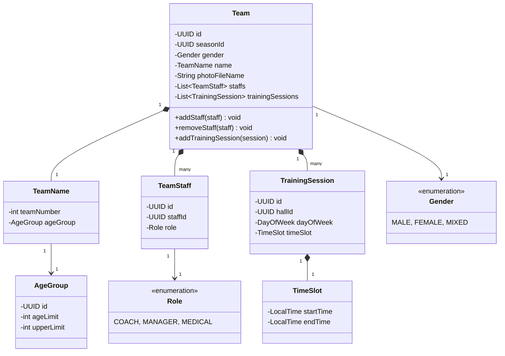
```mermaid
classDiagram
    class Team {
        -UUID id
        -UUID seasonId
        -Gender gender
        -TeamName name
        -String photoFileName
        -List~TeamStaff~ staffs
        -List~TrainingSession~ trainingSessions
        +addStaff(staff) void
        +removeStaff(staff) void
        +addTrainingSession(session) void
    }
    class TeamName {
        -int teamNumber
        -AgeGroup ageGroup
    }
    class AgeGroup {
        -UUID id
        -int ageLimit
        -int upperLimit
    }
    class TeamStaff {
        -UUID id
        -UUID staffId
        -Role role
    }
    class TrainingSession {
        -UUID id
        -UUID hallId
        -DayOfWeek dayOfWeek
        -TimeSlot timeSlot
    }
    class TimeSlot {
        -LocalTime startTime
        -LocalTime endTime
    }
    class Gender {
        <<enumeration>>
        MALE, FEMALE, MIXED
    }
    class Role {
        <<enumeration>>
        COACH, MANAGER, MEDICAL
    }
    
    Team "1" *-- "1" TeamName
    Team "1" *-- "many" TeamStaff
    Team "1" *-- "many" TrainingSession
    TeamName "1" --> "1" AgeGroup
    TeamStaff "1" --> "1" Role
    Team "1" --> "1" Gender
    TrainingSession "1" *-- "1" TimeSlot
```

### 4.2 Module `StaffService` (Encadrants)
Gère le personnel du club.

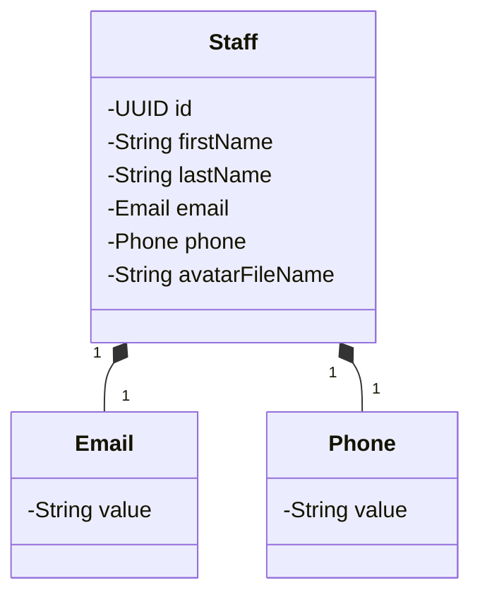
```mermaid
classDiagram
    class Staff {
        -UUID id
        -String firstName
        -String lastName
        -Email email
        -Phone phone
        -String avatarFileName
    }
    class Email {
        -String value
    }
    class Phone {
        -String value
    }
    Staff "1" *-- "1" Email
    Staff "1" *-- "1" Phone
```

### 4.3 Module `HallService` (Salles)
Gère les infrastructures sportives.

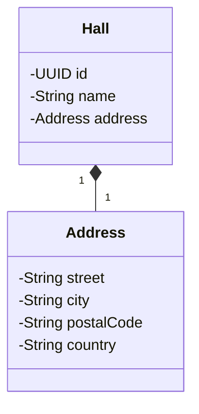
```mermaid
classDiagram
    class Hall {
        -UUID id
        -String name
        -Address address
    }
    class Address {
        -String street
        -String city
        -String postalCode
        -String country
    }
    Hall "1" *-- "1" Address
```

### 4.4 Module `SeasonService` (Saisons)
Gestion du cycle de vie des saisons sportives.

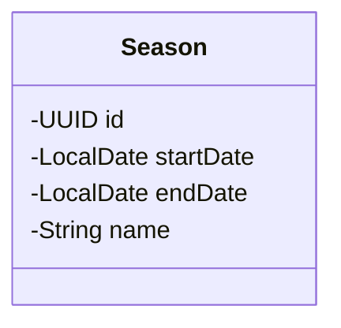
```mermaid
classDiagram
    class Season {
        -UUID id
        -LocalDate startDate
        -LocalDate endDate
        -String name
    }
```

### 4.5 Module `ImageStorageService` (Stockage Technique)
Service transverse pour la gestion des fichiers images.

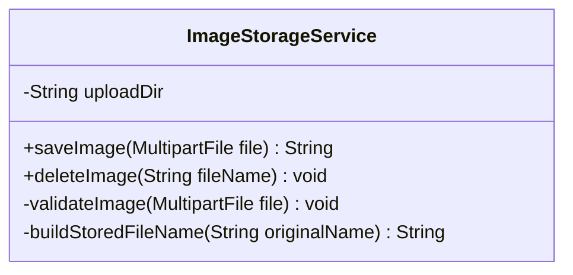
```mermaid
classDiagram
    class ImageStorageService {
        -String uploadDir
        +saveImage(MultipartFile file) String
        +deleteImage(String fileName) void
        -validateImage(MultipartFile file) void
        -buildStoredFileName(String originalName) String
    }
```

### 4.6 Module `ContactService` (Communication)
Gestion des flux de contact par email.

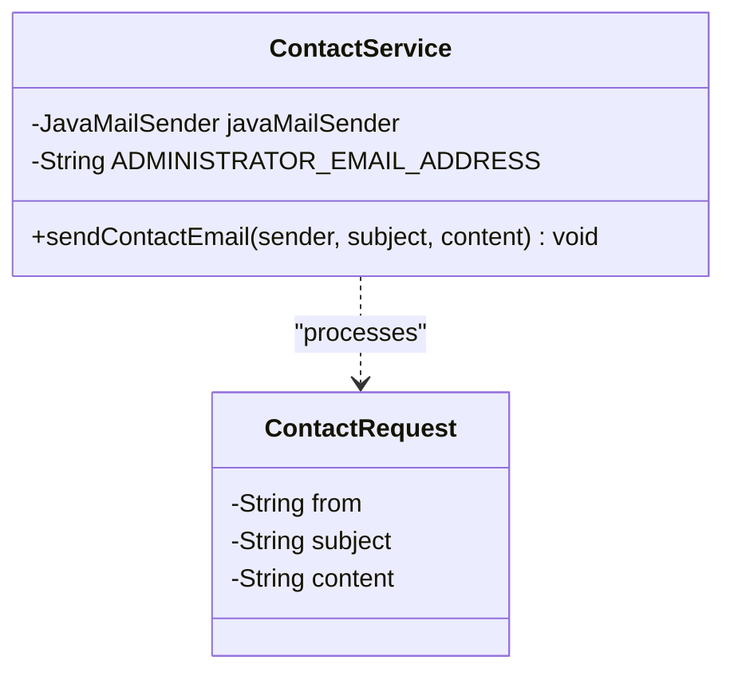
```mermaid
classDiagram
    class ContactService {
        -JavaMailSender javaMailSender
        -String ADMINISTRATOR_EMAIL_ADDRESS
        +sendContactEmail(sender, subject, content) void
    }
    class ContactRequest {
        -String from
        -String subject
        -String content
    }
    ContactService ..> ContactRequest : "processes"
```

### 4.7 Module `MetaService` (Intégration Sociale)
Orchestration des flux Facebook Graph API.

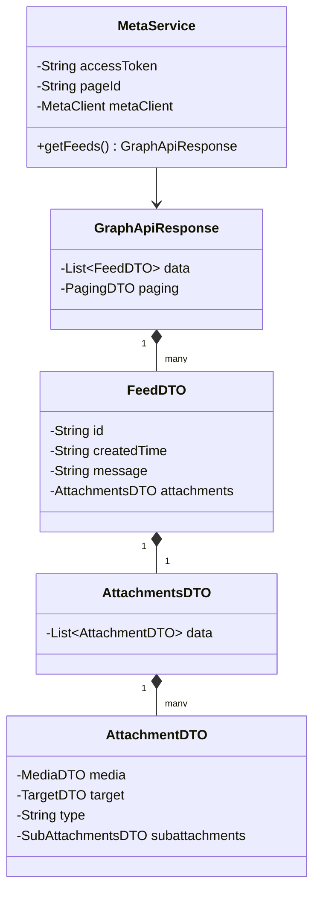
```mermaid
classDiagram
    class MetaService {
        -String accessToken
        -String pageId
        -MetaClient metaClient
        +getFeeds() GraphApiResponse
    }
    class GraphApiResponse {
        -List~FeedDTO~ data
        -PagingDTO paging
    }
    class FeedDTO {
        -String id
        -String createdTime
        -String message
        -AttachmentsDTO attachments
    }
    class AttachmentsDTO {
        -List~AttachmentDTO~ data
    }
    class AttachmentDTO {
        -MediaDTO media
        -TargetDTO target
        -String type
        -SubAttachmentsDTO subattachments
    }
    
    MetaService --> GraphApiResponse
    GraphApiResponse "1" *-- "many" FeedDTO
    FeedDTO "1" *-- "1" AttachmentsDTO
    AttachmentsDTO "1" *-- "many" AttachmentDTO
```

### 4.8 Module `MembershipService` (Adhésions et Campagnes)
Gère les campagnes d'adhésion et les inscriptions des membres.

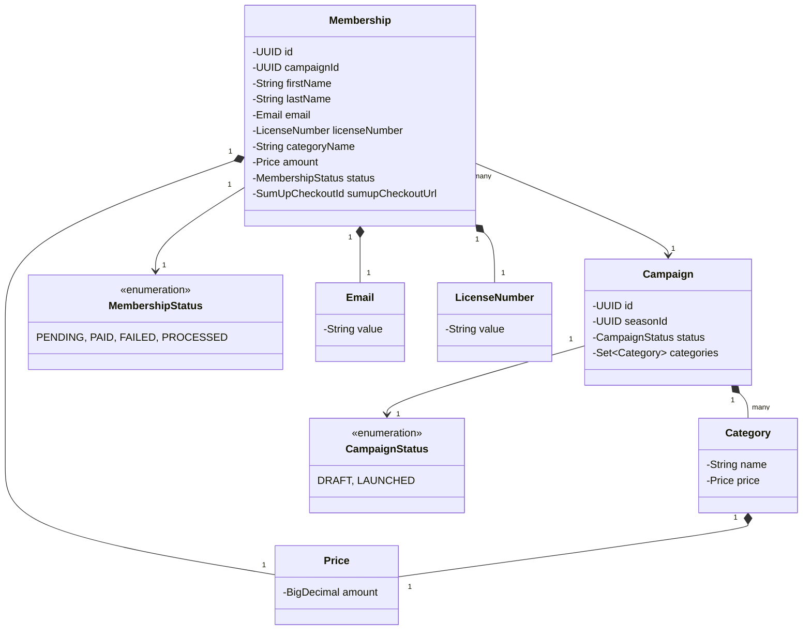
```mermaid
classDiagram
    class Campaign {
        -UUID id
        -UUID seasonId
        -CampaignStatus status
        -Set~Category~ categories
    }
    class Category {
        -String name
        -Price price
    }
    class Membership {
        -UUID id
        -UUID campaignId
        -String firstName
        -String lastName
        -Email email
        -LicenseNumber licenseNumber
        -String categoryName
        -Price amount
        -MembershipStatus status
        -SumUpCheckoutId sumupCheckoutUrl
    }
    class CampaignStatus {
        <<enumeration>>
        DRAFT, LAUNCHED
    }
    class MembershipStatus {
        <<enumeration>>
        PENDING, PAID, FAILED, PROCESSED
    }
    class Price {
        -BigDecimal amount
    }
    class Email {
        -String value
    }
    class LicenseNumber {
        -String value
    }

    Campaign "1" *-- "many" Category
    Campaign "1" --> "1" CampaignStatus
    Membership "many" --> "1" Campaign
    Membership "1" --> "1" MembershipStatus
    Membership "1" *-- "1" Email
    Membership "1" *-- "1" LicenseNumber
    Membership "1" *-- "1" Price
    Category "1" *-- "1" Price
```

---

## 5. Cas d'Utilisation et Flux Détaillés

Cette section présente les interactions entre les acteurs et le système, suivies d'une analyse détaillée de la logique et des flux techniques complets pour chaque fonctionnalité majeure. Chaque flux technique documente avec précision les validations de sécurité (JWT) et la validation des données (`Valid`).

### 5.0. Diagramme de Cas d'Utilisation Global

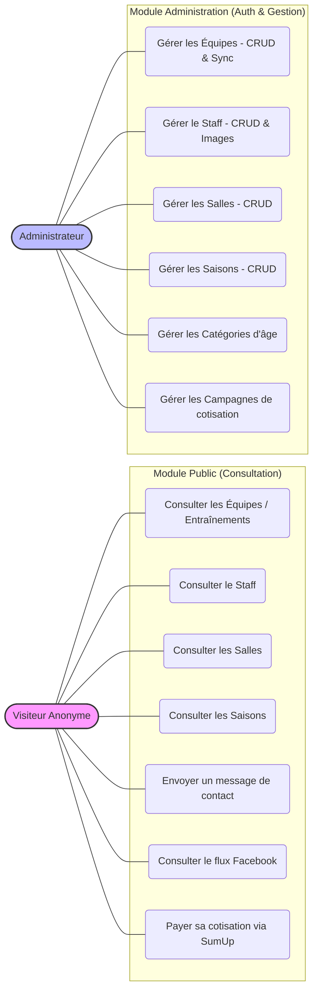
```mermaid
graph LR
    Visitor([Visiteur Anonyme])
    Admin([Administrateur])

    subgraph "Module Public (Consultation)"
        UC_ReadTeams(Consulter les Équipes / Entraînements)
        UC_ReadStaff(Consulter le Staff)
        UC_ReadHalls(Consulter les Salles)
        UC_ReadSeasons(Consulter les Saisons)
        UC_Contact(Envoyer un message de contact)
        UC_Meta(Consulter le flux Facebook)
        UC_PayMembership(Payer sa cotisation via SumUp)
    end

    subgraph "Module Administration (Auth & Gestion)"
        UC_ManageTeams(Gérer les Équipes - CRUD & Sync)
        UC_ManageStaff(Gérer le Staff - CRUD & Images)
        UC_ManageHalls(Gérer les Salles - CRUD)
        UC_ManageSeasons(Gérer les Saisons - CRUD)
        UC_ManageAges(Gérer les Catégories d'âge)
        UC_ManageCampaigns(Gérer les Campagnes de cotisation)
    end

    Visitor --- UC_ReadTeams
    Visitor --- UC_ReadStaff
    Visitor --- UC_ReadHalls
    Visitor --- UC_ReadSeasons
    Visitor --- UC_Contact
    Visitor --- UC_Meta
    Visitor --- UC_PayMembership

    Admin --- UC_ManageTeams
    Admin --- UC_ManageStaff
    Admin --- UC_ManageHalls
    Admin --- UC_ManageSeasons
    Admin --- UC_ManageAges
    Admin --- UC_ManageCampaigns

    style Visitor fill:#f9f,stroke:#333,stroke-width:2px
    style Admin fill:#bbf,stroke:#333,stroke-width:2px
```

### 5.1. Module Équipes (`TeamService` & `AgeGroupService`)

#### 5.1.1. Consultation des Équipes et Catégories (Lecture Publique)
**Description** : Récupère la liste complète des équipes, de leurs membres du staff et des horaires d'entraînement. Cette route est publique et ne nécessite pas d'authentification.

**Diagramme d'Activité**
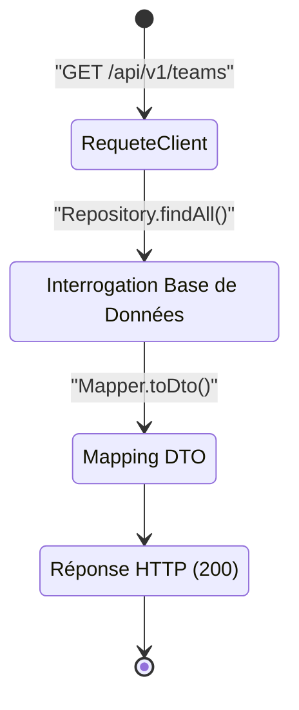
```mermaid
stateDiagram-v2
    [*] --> RequeteClient : "GET /api/v1/teams"
    state "Interrogation Base de Données" as InterrogationDB
    RequeteClient --> InterrogationDB : "Repository.findAll()"
    state "Mapping DTO" as MappingDTO
    InterrogationDB --> MappingDTO : "Mapper.toDto()"
    state "Réponse HTTP (200)" as OK
    MappingDTO --> OK
    OK --> [*]
```

**Diagramme de Séquence**
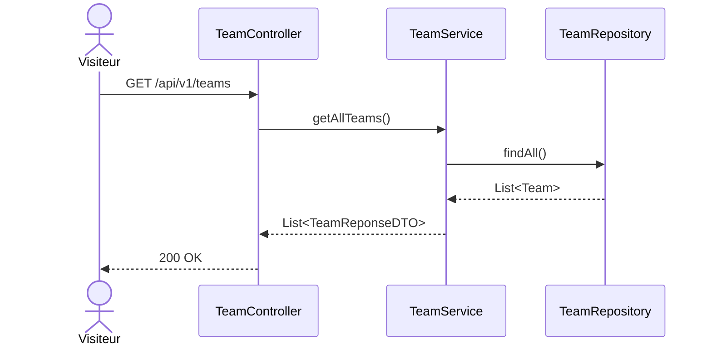
```mermaid
sequenceDiagram
    actor Visiteur
    participant API as TeamController
    participant Service as TeamService
    participant Repo as TeamRepository

    Visiteur->>API: GET /api/v1/teams
    API->>Service: getAllTeams()
    Service->>Repo: findAll()
    Repo-->>Service: List<Team>
    Service-->>API: List<TeamReponseDTO>
    API-->>Visiteur: 200 OK
```
**Structure des données échangées** :
- **Backend → Frontend** (Response) :
```json
[
  {
    "id": "UUID",
    "seasonId": "UUID",
    "gender": "MALE | FEMALE | MIXED",
    "name": { "teamNumber": 1, "ageGroup": { "id": "UUID", "name": "U13" } },
    "photoFileName": "string.jpg",
    "staffs": [ { "id": "UUID", "staffId": "UUID", "role": "COACH" } ],
    "trainingSessions": [ 
       { "id": "UUID", "hallId": "UUID", "dayOfWeek": "MONDAY", "timeSlot": { "startTime": "18:00", "endTime": "19:30" } } 
    ]
  }
]
```


#### 5.1.2. Création d'une Équipe (Admin)
**Description** : Crée une nouvelle équipe en la liant à une saison, à une catégorie d'âge et potentiellement avec une photo de profil via un upload multipart. Le jeton Keycloak et les données sont validés.

**Diagramme d'Activité**
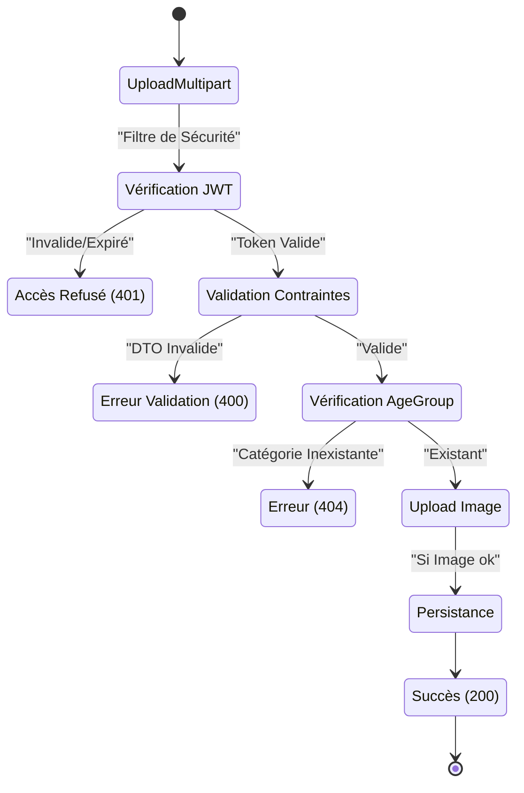
```mermaid
stateDiagram-v2
    [*] --> UploadMultipart
    state "Vérification JWT" as CheckJWT
    UploadMultipart --> CheckJWT : "Filtre de Sécurité"
    state "Accès Refusé (401)" as Denied401
    CheckJWT --> Denied401 : "Invalide/Expiré"
    state "Validation Contraintes" as ValidationContraintes
    CheckJWT --> ValidationContraintes : "Token Valide"
    state "Erreur Validation (400)" as Err400
    ValidationContraintes --> Err400 : "DTO Invalide"
    state "Vérification AgeGroup" as CheckAgeGroup
    ValidationContraintes --> CheckAgeGroup : "Valide"
    state "Erreur (404)" as Err404
    CheckAgeGroup --> Err404 : "Catégorie Inexistante"
    state "Upload Image" as UploadImage
    CheckAgeGroup --> UploadImage : "Existant"
    state "Persistance" as Persistance
    UploadImage --> Persistance : "Si Image ok"
    state "Succès (200)" as Succ200
    Persistance --> Succ200
    Succ200 --> [*]
```

**Diagramme de Séquence**
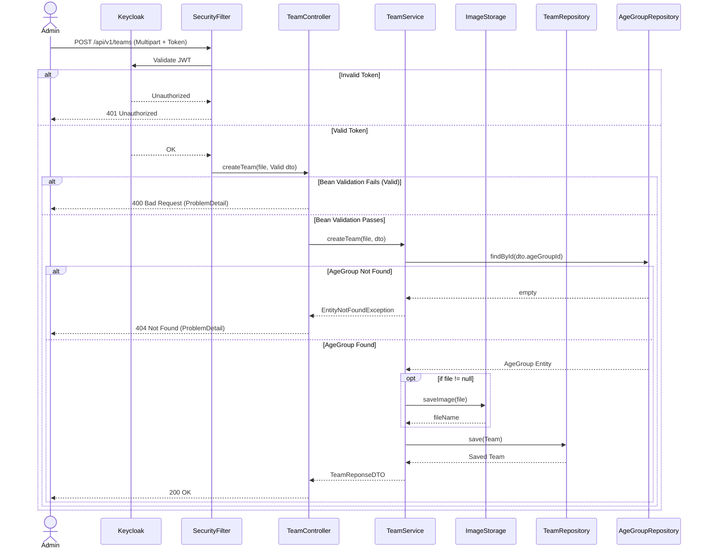
```mermaid
sequenceDiagram
    actor Admin
    participant Keycloak
    participant Filter as SecurityFilter
    participant API as TeamController
    participant Service as TeamService
    participant Image as ImageStorage
    participant Repo as TeamRepository
    participant AgeRepo as AgeGroupRepository

    Admin->>Filter: POST /api/v1/teams (Multipart + Token)
    Filter->>Keycloak: Validate JWT
    alt Invalid Token
        Keycloak-->>Filter: Unauthorized
        Filter-->>Admin: 401 Unauthorized
    else Valid Token
        Keycloak-->>Filter: OK
        Filter->>API: createTeam(file, Valid dto)
        alt Bean Validation Fails (Valid)
            API-->>Admin: 400 Bad Request (ProblemDetail)
        else Bean Validation Passes
            API->>Service: createTeam(file, dto)
            Service->>AgeRepo: findById(dto.ageGroupId)
            alt AgeGroup Not Found
                AgeRepo-->>Service: empty
                Service-->>API: EntityNotFoundException
                API-->>Admin: 404 Not Found (ProblemDetail)
            else AgeGroup Found
                AgeRepo-->>Service: AgeGroup Entity
                opt if file != null
                    Service->>Image: saveImage(file)
                    Image-->>Service: fileName
                end
                Service->>Repo: save(Team)
                Repo-->>Service: Saved Team
                Service-->>API: TeamReponseDTO
                API-->>Admin: 200 OK
            end
        end
    end
```
**Structure des données échangées** :
- **Frontend → Backend** (Request) :
```json
{
  "seasonId": "UUID",
  "gender": "MALE | FEMALE | MIXED",
  "teamNumber": 1,
  "ageGroupId": "UUID",
  "staffs": [ { "role": "COACH", "staffId": "UUID" } ],
  "trainingSessions": [ 
     { "hallId": "UUID", "dayOfWeek": "MONDAY", "timeSlot": { "startTime": "18:00", "endTime": "19:30" } } 
  ],
  "file": "Binary (Multipart)"
}
```
- **Backend → Frontend** (Response) :
```json
{ "id": "UUID", "seasonId": "UUID", ... (TeamReponseDTO) }
```


#### 5.1.3. Mise à jour complexe d'une Équipe (Admin)
**Description** : Met à jour l'équipe tout en synchronisant les listes de `TeamStaff` et `TrainingSession`. Les données sont formellement validées avant traitement.

**Diagramme d'Activité**
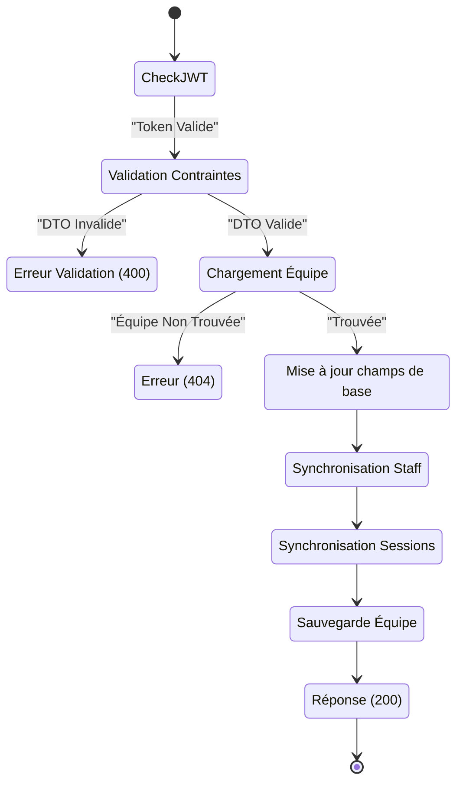
```mermaid
stateDiagram-v2
    [*] --> CheckJWT
    state "Validation Contraintes" as ValidationContraintes
    CheckJWT --> ValidationContraintes : "Token Valide"
    state "Erreur Validation (400)" as Err400
    ValidationContraintes --> Err400 : "DTO Invalide"
    state "Chargement Équipe" as LoadTeam
    ValidationContraintes --> LoadTeam : "DTO Valide"
    state "Erreur (404)" as Err404
    LoadTeam --> Err404 : "Équipe Non Trouvée"
    state "Mise à jour champs de base" as UpdateBaseFields
    LoadTeam --> UpdateBaseFields : "Trouvée"
    state "Synchronisation Staff" as SyncStaffList
    UpdateBaseFields --> SyncStaffList
    state "Synchronisation Sessions" as SyncSessionsList
    SyncStaffList --> SyncSessionsList
    state "Sauvegarde Équipe" as SaveTeam
    SyncSessionsList --> SaveTeam
    state "Réponse (200)" as Resp200
    SaveTeam --> Resp200
    Resp200 --> [*]
```

**Diagramme de Séquence**
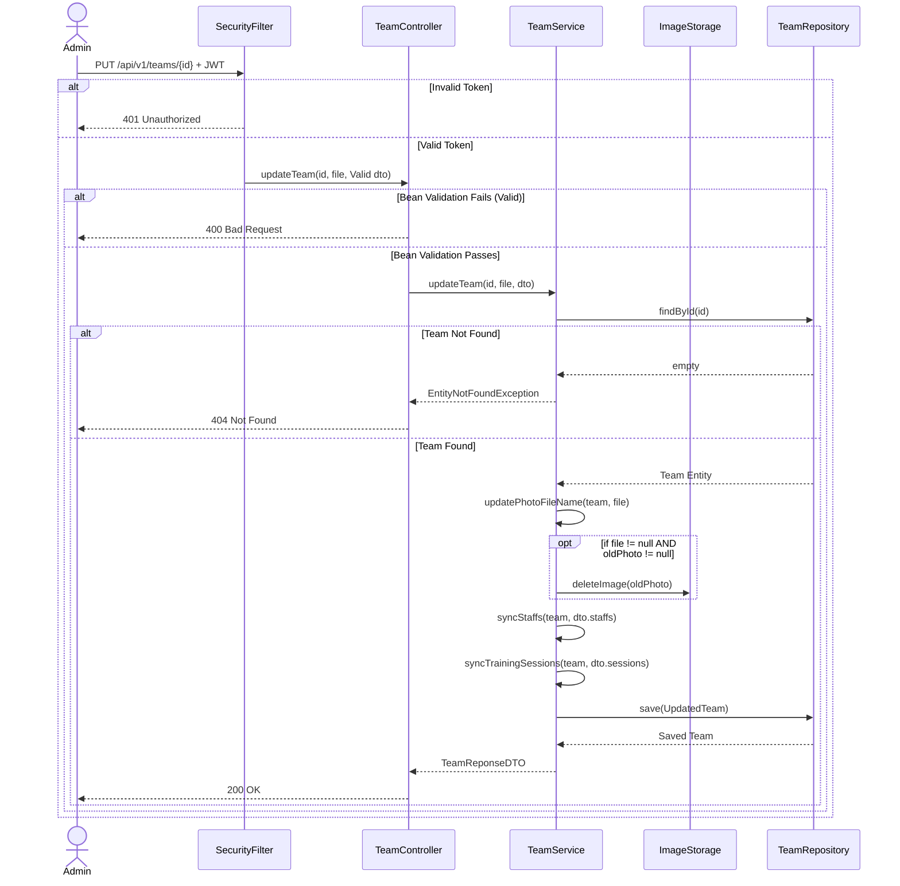
```mermaid
sequenceDiagram
    actor Admin
    participant Filter as SecurityFilter
    participant API as TeamController
    participant Service as TeamService
    participant Image as ImageStorage
    participant Repo as TeamRepository

    Admin->>Filter: PUT /api/v1/teams/{id} + JWT
    alt Invalid Token
        Filter-->>Admin: 401 Unauthorized
    else Valid Token
        Filter->>API: updateTeam(id, file, Valid dto)
        alt Bean Validation Fails (Valid)
            API-->>Admin: 400 Bad Request
        else Bean Validation Passes
            API->>Service: updateTeam(id, file, dto)
            Service->>Repo: findById(id)
            alt Team Not Found
                Repo-->>Service: empty
                Service-->>API: EntityNotFoundException
                API-->>Admin: 404 Not Found
            else Team Found
                Repo-->>Service: Team Entity
                Service->>Service: updatePhotoFileName(team, file)
                opt if file != null AND oldPhoto != null
                    Service->>Image: deleteImage(oldPhoto)
                end
                Service->>Service: syncStaffs(team, dto.staffs)
                Service->>Service: syncTrainingSessions(team, dto.sessions)
                Service->>Repo: save(UpdatedTeam)
                Repo-->>Service: Saved Team
                Service-->>API: TeamReponseDTO
                API-->>Admin: 200 OK
            end
        end
    end
```

#### 5.1.4. Suppression d'une Équipe (Admin)
**Description** : Suppression physique d'une équipe. Nécessite authentification.

**Diagramme d'Activité**
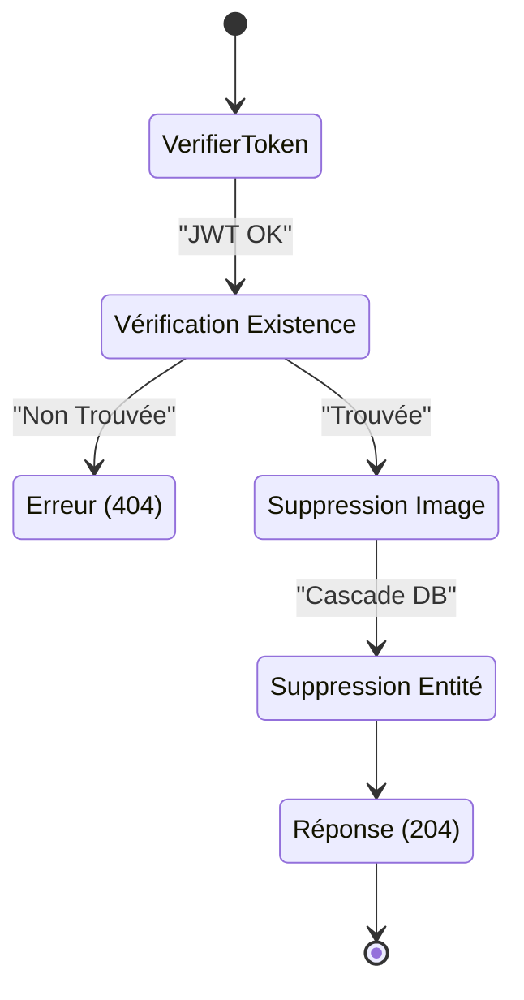
```mermaid
stateDiagram-v2
    [*] --> VerifierToken
    state "Vérification Existence" as CheckExistence
    VerifierToken --> CheckExistence : "JWT OK"
    state "Erreur (404)" as Err404
    CheckExistence --> Err404 : "Non Trouvée"
    state "Suppression Image" as DeleteImage
    CheckExistence --> DeleteImage : "Trouvée"
    state "Suppression Entité" as DeleteEntity
    DeleteImage --> DeleteEntity : "Cascade DB"
    state "Réponse (204)" as Resp204
    DeleteEntity --> Resp204
    Resp204 --> [*]
```

**Diagramme de Séquence**
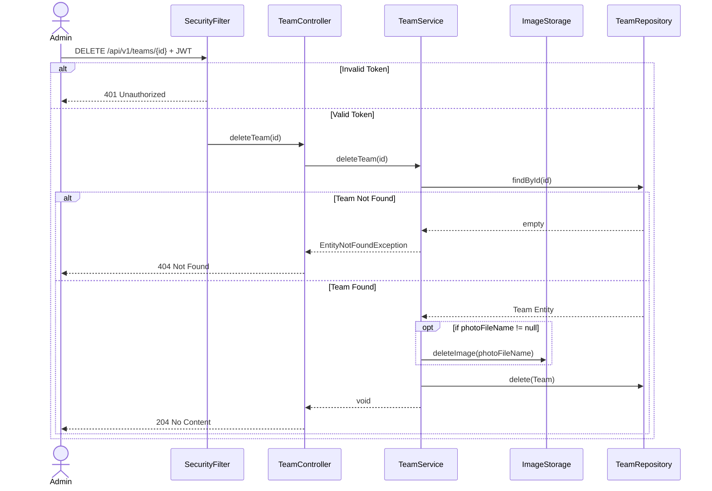
```mermaid
sequenceDiagram
    actor Admin
    participant Filter as SecurityFilter
    participant API as TeamController
    participant Service as TeamService
    participant Image as ImageStorage
    participant Repo as TeamRepository

    Admin->>Filter: DELETE /api/v1/teams/{id} + JWT
    alt Invalid Token
        Filter-->>Admin: 401 Unauthorized
    else Valid Token
        Filter->>API: deleteTeam(id)
        API->>Service: deleteTeam(id)
        Service->>Repo: findById(id)
        alt Team Not Found
            Repo-->>Service: empty
            Service-->>API: EntityNotFoundException
            API-->>Admin: 404 Not Found
        else Team Found
            Repo-->>Service: Team Entity
            opt if photoFileName != null
                Service->>Image: deleteImage(photoFileName)
            end
            Service->>Repo: delete(Team)
            Service-->>API: void
            API-->>Admin: 204 No Content
        end
    end
```

#### 5.1.5. Gestion des Catégories d'Âge (Admin)
**Description** : Création d'une catégorie d'âge. Valide formellement l'objet avant la sauvegarde.

**Diagramme d'Activité**
```mermaid
stateDiagram-v2
    [*] --> Request
    state "Validation Authentification" as ValidationAuth
    Request --> ValidationAuth
    state "Vérification Entité" as CheckEntity
    ValidationAuth --> CheckEntity : "JWT OK"
    state "Validation Limites" as ValidateLimits
    CheckEntity --> ValidateLimits : "Valid Check (ageLimit inferieur a upperLimit)"
    state "Erreur Validation (400)" as Err400
    ValidateLimits --> Err400 : "Invalide"
    state "Opération Base de Données" as DatabaseOp
    ValidateLimits --> DatabaseOp : "Valide"
    state "Réponse HTTP (200)" as Resp200
    DatabaseOp --> Resp200
    Resp200 --> [*]
```

**Diagramme de Séquence (Création)**
```mermaid
sequenceDiagram
    actor Admin
    participant Filter as SecurityFilter
    participant API as AgeGroupController
    participant Service as AgeGroupService
    participant Repo as AgeGroupRepository

    Admin->>Filter: POST /api/v1/age-groups + JWT
    alt Invalid Token
        Filter-->>Admin: 401 Unauthorized
    else Valid Token
        Filter->>API: createAgeGroup(Valid dto)
        alt Bean Validation Fails (Valid)
            API-->>Admin: 400 Bad Request
        else Bean Validation Passes
            API->>Service: createAgeGroup(dto)
            Service->>Repo: save(AgeGroup)
            Repo-->>Service: Saved Entity
            Service-->>API: AgeGroupResponseDTO
            API-->>Admin: 200 OK
        end
    end
```

### 5.2. Module Encadrants (`StaffService`)

#### 5.2.1. Consultation des Encadrants (Lecture Publique)
**Description** : Liste l'ensemble du staff. Route publique.

**Diagramme d'Activité**
```mermaid
stateDiagram-v2
    [*] --> LecturePublique
    state "Récupération Staff" as FetchStaff
    LecturePublique --> FetchStaff
    state "Mapping DTO" as MappingDTO
    FetchStaff --> MappingDTO
    state "Réponse (200)" as Resp200
    MappingDTO --> Resp200
    Resp200 --> [*]
```

**Diagramme de Séquence**
```mermaid
sequenceDiagram
    actor Visiteur
    participant API as StaffController
    participant Service as StaffService
    participant Repo as StaffRepository

    Visiteur->>API: GET /api/v1/staffs
    API->>Service: getAllStaff()
    Service->>Repo: findAll()
    Repo-->>Service: List<Staff>
    Service-->>API: List<StaffResponseDto>
    API-->>Visiteur: 200 OK
```
**Structure des données échangées** :
- **Backend → Frontend** (Response) :
```json
[
  {
    "id": "UUID",
    "firstName": "John",
    "lastName": "Doe",
    "email": "john.doe@example.com",
    "phone": "+33600000000",
    "avatarFileName": "uuid_avatar.jpg"
  }
]
```


#### 5.2.2. Création / Mise à jour d'un Encadrant (Admin)
**Description** : Met à jour l'identité du staff. Vérifie le JWT, valide formellement le DTO, et gère le remplacement de l'avatar.

**Diagramme d'Activité**
```mermaid
stateDiagram-v2
    [*] --> Request
    state "Authentification" as Auth
    Request --> Auth
    state "Validations" as Validations
    Auth --> Validations : "JWT OK"
    state "Erreur (400)" as Err400
    Validations --> Err400 : "Invalide"
    state "Recherche Ancien Staff" as FindOldStaff
    Validations --> FindOldStaff : "Valide"
    state "Erreur (404)" as Err404
    FindOldStaff --> Err404 : "Non Trouvé"
    state "Nettoyage Ancienne Image" as CleanOldImage
    FindOldStaff --> CleanOldImage : "Trouvé"
    state "Sauvegarde Nouvelle Image" as SaveNewImage
    CleanOldImage --> SaveNewImage
    state "Mise à jour Données" as UpdateEntityData
    SaveNewImage --> UpdateEntityData
    state "Sauvegarde BDD" as SaveDB
    UpdateEntityData --> SaveDB
    SaveDB --> [*]
```

**Diagramme de Séquence (Mise à jour)**
```mermaid
sequenceDiagram
    actor Admin
    participant Filter as SecurityFilter
    participant API as StaffController
    participant Service as StaffService
    participant Img as ImageStorageService
    participant Repo as StaffRepository

    Admin->>Filter: PUT /api/v1/staffs/{id} (Multipart + JWT)
    alt Invalid Token
        Filter-->>Admin: 401 Unauthorized
    else Valid Token
        Filter->>API: updateStaff(id, file, Valid dto)
        alt Bean Validation Fails (Valid)
            API-->>Admin: 400 Bad Request
        else Bean Validation Passes
            API->>Service: updateStaff(id, file, dto)
            Service->>Repo: findById(id)
            alt Staff Not Found
                Repo-->>Service: empty
                Service-->>API: EntityNotFoundException
                API-->>Admin: 404 Not Found
            else Staff Found
                Repo-->>Service: Staff Entity
                Service->>Service: updateAvatarFileName(...)
                opt file != null AND oldAvatar != null
                    Service->>Img: deleteImage(oldAvatar)
                end
                opt file != null
                    Service->>Img: saveImage(file)
                    Img-->>Service: newAvatarName
                end
                Service->>Repo: save(Staff)
                Repo-->>Service: Saved Entity
                Service-->>API: StaffResponseDto
                API-->>Admin: 200 OK
            end
        end
    end
```
**Structure des données échangées** :
- **Frontend → Backend** (Request) :
```json
{
  "firstName": "string",
  "lastName": "string",
  "email": "string (optional)",
  "phone": "string (optional)",
  "file": "Binary (Multipart, optional)"
}
```
- **Backend → Frontend** (Response) :
```json
{ "id": "UUID", "firstName": "string", ... (StaffResponseDto) }
```


#### 5.2.3. Suppression d'un Encadrant (Event-Driven - Admin)
**Description** : Supprime un membre du staff (nécessite un JWT). La suppression déclenche un nettoyage asynchrone dans les équipes.

**Diagramme d'Activité**
```mermaid
stateDiagram-v2
    [*] --> RequestDelete
    state "Vérification Token" as VerifierToken
    RequestDelete --> VerifierToken
    state "Vérification Existence" as CheckExistence
    VerifierToken --> CheckExistence : "JWT OK"
    state "Suppression Image" as DeleteStaffImage
    CheckExistence --> DeleteStaffImage : "Staff Trouvé"
    state "Suppression Staff BDD" as DeleteStaffDB
    DeleteStaffImage --> DeleteStaffDB
    state "Publication Événement" as PublishEvent
    DeleteStaffDB --> PublishEvent
    state "Réponse HTTP (204)" as Resp204
    PublishEvent --> Resp204
    state "Interception Listener Team" as TeamListenerCatch
    PublishEvent --> TeamListenerCatch : "Asynchrone"
    state "Mise à jour Équipes BDD" as UpdateTeamsDB
    TeamListenerCatch --> UpdateTeamsDB
    UpdateTeamsDB --> [*]
    Resp204 --> [*]
```

**Diagramme de Séquence**
```mermaid
sequenceDiagram
    actor Admin
    participant Filter as SecurityFilter
    participant API as StaffController
    participant Service as StaffService
    participant Repo as StaffRepository
    participant EventBus as ApplicationEventPublisher
    participant TeamAPI as TeamModule (Listener)

    Admin->>Filter: DELETE /api/v1/staffs/{id} + JWT
    alt Invalid Token
        Filter-->>Admin: 401 Unauthorized
    else Valid Token
        Filter->>API: deleteStaff(id)
        API->>Service: deleteStaff(id)
        Service->>Repo: findById(id)
        alt Staff Not Found
            Repo-->>Service: empty
            Service-->>API: EntityNotFoundException
            API-->>Admin: 404 Not Found
        else Staff Found
            Repo-->>Service: Staff Entity
            Service->>Service: ImageStorageService.deleteImage(...)
            Service->>Repo: delete(staff)
            Service->>EventBus: publishEvent(new StaffDeletedEvent(id))
            Service-->>API: void
            API-->>Admin: 204 No Content

            Note right of EventBus: Traitement Asynchrone
            EventBus->>TeamAPI: onStaffDeleted(event)
            TeamAPI->>TeamAPI: TeamRepository.findDistinctByStaffs_StaffId(id)
            TeamAPI->>TeamAPI: removeStaff() on matching Teams
            TeamAPI->>TeamAPI: TeamRepository.saveAll(teams)
        end
    end
```

### 5.3. Module Salles (`HallService`)

#### 5.3.1. Consultation des Salles (Lecture Publique)
**Description** : Récupère la liste de toutes les salles de sport. Route publique.

**Diagramme d'Activité**
```mermaid
stateDiagram-v2
    [*] --> ReadHalls
    state "Mapping Réponse" as MapToResponse
    ReadHalls --> MapToResponse
    state "Retour (200)" as Ret200
    MapToResponse --> Ret200
    Ret200 --> [*]
```

**Diagramme de Séquence**
```mermaid
sequenceDiagram
    actor Visiteur
    participant API as HallController
    participant Service as HallService

    Visiteur->>API: GET /api/v1/halls
    API->>Service: getAllHalls()
    Service-->>API: List<HallResponse>
    API-->>Visiteur: 200 OK
```
**Structure des données échangées** :
- **Backend → Frontend** (Response) :
```json
[
  {
    "id": "UUID",
    "name": "Gymnase A",
    "addressStreet": "1 rue des Sports",
    "addressCity": "Hoenheim",
    "addressPostalCode": "67800",
    "addressCountry": "France"
  }
]
```


#### 5.3.2. Création d'une Salle (Admin)
**Description** : Valide l'adresse et le nom lors de la création d'une infrastructure. JWT requis.

**Diagramme d'Activité**
```mermaid
stateDiagram-v2
    [*] --> Saisie
    state "Vérification JWT" as VerifyJWT
    Saisie --> VerifyJWT
    state "Validation" as Validation
    VerifyJWT --> Validation : "JWT OK"
    state "Erreur (400)" as Err400
    Validation --> Err400 : "Nom/Adresse Invalide"
    state "Sauvegarde BDD" as SauvegardeDB
    Validation --> SauvegardeDB : "Valide"
    state "Succès (200)" as Succ200
    SauvegardeDB --> Succ200
    Succ200 --> [*]
```

**Diagramme de Séquence**
```mermaid
sequenceDiagram
    actor Admin
    participant Filter as SecurityFilter
    participant API as HallController
    participant Service as HallService
    participant Repo as HallRepository

    Admin->>Filter: POST /api/v1/halls + JWT
    alt Invalid Token
        Filter-->>Admin: 401 Unauthorized
    else Valid Token
        Filter->>API: createHall(Valid request)
        alt Bean Validation Fails (Valid)
            API-->>Admin: 400 Bad Request
        else Bean Validation Passes
            API->>Service: createHall(request)
            Service->>Repo: save(Hall)
            Repo-->>Service: Saved Entity
            Service-->>API: HallResponse
            API-->>Admin: 200 OK
        end
    end
```
**Structure des données échangées** :
- **Frontend → Backend** (Request) :
```json
{
  "name": "string",
  "addressStreet": "string",
  "addressCity": "string",
  "addressPostalCode": "string",
  "addressCountry": "string"
}
```
- **Backend → Frontend** (Response) :
```json
{ "id": "UUID", "name": "string", ... (HallResponse) }
```


### 5.4. Module Saisons (`SeasonService`)

#### 5.4.1. Consultation des Saisons (Lecture Publique)
**Description** : Affiche toutes les saisons de l'historique du club.

**Diagramme d'Activité**
```mermaid
stateDiagram-v2
    [*] --> Lecture
    state "Recherche Repository" as RepoFindAll
    Lecture --> RepoFindAll
    state "Mapping DTO" as MapToDto
    RepoFindAll --> MapToDto
    state "Réponse (200)" as Resp200
    MapToDto --> Resp200
    Resp200 --> [*]
```

**Diagramme de Séquence**
```mermaid
sequenceDiagram
    actor Visiteur
    participant API as SeasonController
    participant Service as SeasonService

    Visiteur->>API: GET /api/v1/seasons
    API->>Service: getAllSeasons()
    Service-->>API: List<SeasonResponse>
    API-->>Visiteur: 200 OK
```
**Structure des données échangées** :
- **Backend → Frontend** (Response) :
```json
[
  {
    "id": "UUID",
    "startDate": "2025-09-01",
    "endDate": "2026-06-30",
    "name": "Saison 2025 - 2026",
    "isCurrent": true
  }
]
```


#### 5.4.2. Création d'une Saison (Admin)
**Description** : Flux protégé. Valide le DTO, puis valide algorithmiquement que `startDate < endDate`.

**Diagramme d'Activité**
```mermaid
stateDiagram-v2
    [*] --> RequestSeason
    state "Vérification JWT" as JWT_Check
    RequestSeason --> JWT_Check
    state "Validation Bean" as ValidationBean
    JWT_Check --> ValidationBean : "Token Valide"
    state "Erreur Validation (400)" as Err400
    ValidationBean --> Err400 : "DTO Invalide"
    state "Validation Dates" as ValidateDates
    ValidationBean --> ValidateDates : "DTO Valide"
    state "Erreur Date (400)" as ErrDate400
    ValidateDates --> ErrDate400 : "Invalide"
    state "Génération Nom" as GenerateName
    ValidateDates --> GenerateName : "Valide"
    state "Sauvegarde BDD" as DB_Save
    GenerateName --> DB_Save
    state "Réponse OK (200)" as Resp200
    DB_Save --> Resp200
    Resp200 --> [*]
```

**Diagramme de Séquence**
```mermaid
sequenceDiagram
    actor Admin
    participant Filter as SecurityFilter
    participant API as SeasonController
    participant Service as SeasonService
    participant Repo as SeasonRepository

    Admin->>Filter: POST /api/v1/seasons + JWT
    alt Invalid Token
        Filter-->>Admin: 401 Unauthorized
    else Valid Token
        Filter->>API: createSeason(Valid request)
        alt Bean Validation Fails (Valid)
            API-->>Admin: 400 Bad Request
        else Bean Validation Passes
            API->>Service: createSeason(request)
            Service->>Service: assertValidDateRange(start, end)
            alt Invalid Date Range
                Service-->>API: RangeDateException
                API-->>Admin: 400 Bad Request (Custom Exception)
            else Valid Date Range
                Service->>Service: createSeasonName(start, end)
                Service->>Repo: save(Season)
                Repo-->>Service: Saved Entity
                Service-->>API: SeasonResponse
                API-->>Admin: 200 OK
            end
        end
    end
```
**Structure des données échangées** :
- **Frontend → Backend** (Request) :
```json
{
  "startDate": "YYYY-MM-DD",
  "endDate": "YYYY-MM-DD"
}
```
- **Backend → Frontend** (Response) :
```json
{ "id": "UUID", "name": "Saison 2025 - 2026", ... (SeasonResponse) }
```


#### 5.4.3. Suppression d'une Saison avec blocage métier (Admin)
**Description** : Vérifie l'absence de lien avec une équipe existante avant de supprimer.

**Diagramme d'Activité**
```mermaid
stateDiagram-v2
    [*] --> DeleteRequest
    state "Vérification Authentification" as CheckAuth
    DeleteRequest --> CheckAuth
    state "Récupération Saison" as FetchSeason
    CheckAuth --> FetchSeason : "JWT OK"
    state "Erreur Non Trouvé (404)" as Err404
    FetchSeason --> Err404 : "Inexistante"
    state "Vérification Associations" as CheckAssociations
    FetchSeason --> CheckAssociations : "Trouvée"
    state "Récupération Équipes" as FetchTeams
    CheckAssociations --> FetchTeams : "TeamAPI.findTeamUUIDBySeasonUUID()"
    state "Erreur Utilisée (400)" as Err400
    FetchTeams --> Err400 : "count > 0"
    state "Suppression Saison" as DeleteSeason
    FetchTeams --> DeleteSeason : "count == 0"
    state "Réponse (204)" as Resp204
    DeleteSeason --> Resp204
    Resp204 --> [*]
```

**Diagramme de Séquence**
```mermaid
sequenceDiagram
    actor Admin
    participant Filter as SecurityFilter
    participant API as SeasonController
    participant Service as SeasonService
    participant Repo as SeasonRepository
    participant TeamAPI as TeamAPI (Module Team)

    Admin->>Filter: DELETE /api/v1/seasons/{id} + JWT
    alt Invalid Token
        Filter-->>Admin: 401 Unauthorized
    else Valid Token
        Filter->>API: deleteSeason(id)
        API->>Service: deleteById(id)
        Service->>Repo: findById(id)
        alt Season Not Found
            Repo-->>Service: empty
            Service-->>API: EntityNotFoundException
            API-->>Admin: 404 Not Found
        else Season Found
            Service->>TeamAPI: findTeamUUIDBySeasonUUID(id)
            TeamAPI-->>Service: List of Team UUIDs
            alt List is NOT empty
                Service-->>API: SeasonInUseException
                API-->>Admin: 400 Bad Request
            else List is empty
                Service->>Repo: delete(Season)
                Service-->>API: void
                API-->>Admin: 204 No Content
            end
        end
    end
```

### 5.5. Module Contact (`ContactService`)

#### 5.5.1. Envoi d'un message depuis le formulaire (Public)
**Description** : Route publique pour envoyer un mail. Validation forte du contenu avant transmission.

**Diagramme d'Activité**
```mermaid
stateDiagram-v2
    [*] --> FormulairePublic
    state "Validation Bean" as ValidationBean
    FormulairePublic --> ValidationBean
    state "Erreur (400)" as Err400
    ValidationBean --> Err400 : "Invalide"
    state "Construction Message" as ConstruitMessage
    ValidationBean --> ConstruitMessage : "Valide"
    state "Appel Serveur SMTP" as AppelleServeurSMTP
    ConstruitMessage --> AppelleServeurSMTP
    state "Succès Envoi" as SuccesEnvoi
    AppelleServeurSMTP --> SuccesEnvoi
    state "Échec SMTP (500)" as Err500
    AppelleServeurSMTP --> Err500 : "Erreur Envoi"
    state "Réponse HTTP (200)" as Resp200
    SuccesEnvoi --> Resp200
    Resp200 --> [*]
```

**Diagramme de Séquence**
```mermaid
sequenceDiagram
    actor Visiteur
    participant API as ContactController
    participant Service as ContactService
    participant Mail as JavaMailSender

    Visiteur->>API: POST /api/v1/contact/send
    API->>API: Validation Bean (Valid)
    alt Validation Bean Échoue
        API-->>Visiteur: 400 Bad Request
    else Validation Bean Réussit
        API->>Service: sendContactEmail(request)
        Service->>Mail: send(SimpleMailMessage)
        alt SMTP Failure
            Mail-->>Service: Exception
            Service-->>API: MailServiceException
            API-->>Visiteur: 500 Internal Server Error
        else SMTP Success
            Mail-->>Service: OK
            Service-->>API: void
            API-->>Visiteur: 200 OK
        end
    end
```
**Structure des données échangées** :
- **Frontend → Backend** (Request) :
```json
{
  "from": "user@example.com",
  "subject": "Sujet du message",
  "content": "Contenu détaillé du message"
}
```
- **Backend → Frontend** (Response) :
```json
// No body (200 OK)
```


### 5.6. Module Réseaux Sociaux (`MetaService`)

#### 5.6.1. Récupération optimisée du flux Facebook (Public)
**Description** : Requête publique. Vérifie le cache et interroge le Graph API de Meta si nécessaire avec un `@Retryable`.

**Diagramme d'Activité**
```mermaid
stateDiagram-v2
    [*] --> RequestFeed
    state "Vérification Cache" as CheckCache
    RequestFeed --> CheckCache
    state "Retour Resultat (200)" as Ret200
    CheckCache --> Ret200 : "Cache Hit"
    state "Appel Meta Graph API" as MetaGraphAPI
    CheckCache --> MetaGraphAPI : "Cache Miss"
    state "Pattern de Retry" as RetryPattern
    MetaGraphAPI --> RetryPattern : "Échec HTTP"
    RetryPattern --> MetaGraphAPI : "Moins de 2 tentatives"
    state "Erreur API (500)" as Err500
    RetryPattern --> Err500 : "Échec"
    state "Mapping Données" as MappingData
    MetaGraphAPI --> MappingData : "Succès"
    state "Mise à jour Cache" as UpdateCache
    MappingData --> UpdateCache
    state "Retour Resultat (200)" as Ret200Final
    UpdateCache --> Ret200Final
    Ret200Final --> [*]
```

**Diagramme de Séquence**
```mermaid
sequenceDiagram
    actor Visiteur
    participant API as MetaController
    participant Service as MetaService
    participant Cache as Caffeine
    participant Feign as MetaClient (HTTP)
    participant FB as Meta Graph API

    Visiteur->>API: GET /api/v1/meta/feeds
    API->>Service: getFeeds()
    Service->>Cache: Interroge "metaFeeds"
    alt Cache Hit
        Cache-->>Service: GraphApiResponse
    else Cache Miss
        Service->>Feign: getFeeds(token, pageId)
        Feign->>FB: HTTP GET /feed
        alt API Call Fails
            FB-->>Feign: Error
            Note right of Service: @Retryable (Max 2 retries)
            Feign->>FB: Retry HTTP GET /feed
            alt All Retries Fail
                FB-->>Feign: Error
                Feign-->>Service: FeignException
                Service-->>API: Exception
                API-->>Visiteur: 500 Internal Server Error
            end
        end
        FB-->>Feign: JSON GraphApiResponse
        Feign-->>Service: GraphApiResponse
        Service->>Cache: Stocke (metaFeeds)
    end
    Service-->>API: GraphApiResponse
    API-->>Visiteur: 200 OK
```
**Structure des données échangées** :
- **Backend → Frontend** (Response) :
```json
{
  "data": [
    {
      "id": "string",
      "createdTime": "ISO8601",
      "message": "Texte du post",
      "attachments": { "data": [ ... ] }
    }
  ],
  "paging": { ... }
}
```


### 5.7. Module Memberships (`MembershipService`)

#### 5.7.1. Paiement de cotisation (Public & SumUp)
**Description** : Un visiteur remplit le formulaire, un `Membership` `PENDING` est créé, et il est redirigé vers SumUp. Le statut est mis à jour via webhook.

**Diagramme de Séquence**
```mermaid
sequenceDiagram
    actor Visitor
    participant App as App Frontend
    participant API as MembershipController
    participant SumUp as SumUp API
    participant DB as Database
    participant Hook as WebhookController
    participant Bus as EventBus

    Visitor->>App: Remplit le formulaire
    App->>API: POST /api/public/memberships (Public)
    API->>DB: save(Membership PENDING)
    API->>SumUp: POST /checkouts (Hosted)
    SumUp-->>API: 200 OK (hosted_checkout_url)
    API-->>App: 200 OK (url)
    App->>Visitor: Redirection vers SumUp
    
    Note over Visitor,SumUp: Paiement sur la page SumUp
    
    SumUp->>Hook: POST /api/webhooks/sumup (status: PAID)
    Hook->>Bus: publish(SumUpPaymentEvent)
    Bus->>API: updateStatus(membershipId, PAID)
    API->>DB: update Membership status
    
    SumUp->>Visitor: Redirection vers /membership/success
```

#### 5.7.2. Gestion des Campagnes (Admin)
**Description** : L'administrateur configure la saison et les prix par catégorie.

**Diagramme de Séquence**
```mermaid
sequenceDiagram
    actor Admin
    participant API as CampaignController
    participant DB as Database

    Admin->>API: POST /api/campaigns (Season + Categories)
    API->>DB: save(Campaign DRAFT)
    Admin->>API: PATCH /api/campaigns/{id}/launch
    API->>DB: update status LAUNCHED
```

---

## 6. Spécifications Techniques et Standards

### 6.1. Qualité du Code et Robustesse
*   **Test-Driven Development (TDD)** : Priorité absolue. Chaque fonctionnalité est couverte par des tests unitaires, des tests de tranches (@WebMvcTest) et des tests d'intégration complets.
*   **Politique "Zéro Null"** : Utilisation systématique de `@NullMarked` (JSpecify) au niveau des packages et de `Optional<T>` pour les retours de méthodes, garantissant une robustesse accrue contre les `NullPointerException`.
*   **Validation Stricte** : Utilisation de Jakarta Bean Validation (`Valid`, `@NotBlank`, `@NotNull`) sur tous les DTO entrants.

### 6.2. Architecture et Sécurité
*   **Spring Modulith** : Garantit une architecture propre où les dépendances entre modules sont vérifiées au moment du test (`ArchitectureTests.java`).
*   **Keycloak & OAuth2** : Authentification centralisée avec validation des JWT via les clés publiques du serveur d'identité.
*   **Isolation des Données** : Utilisation de schémas PostgreSQL distincts (`staff_schema`, `team_schema`, etc.) pour une encapsulation parfaite au niveau de la persistance.

### 6.3. Documentation et Maintenance
*   **OpenAPI 3 / Scalar** : Documentation interactive auto-générée disponible sur `/scalar` pour faciliter l'intégration frontend et les tests manuels.
*   **Monorepo Angular** : Facilite la gestion des dépendances partagées et assure une cohérence des modèles de données entre le front et le back via les bibliothèques `shared-domain`.

